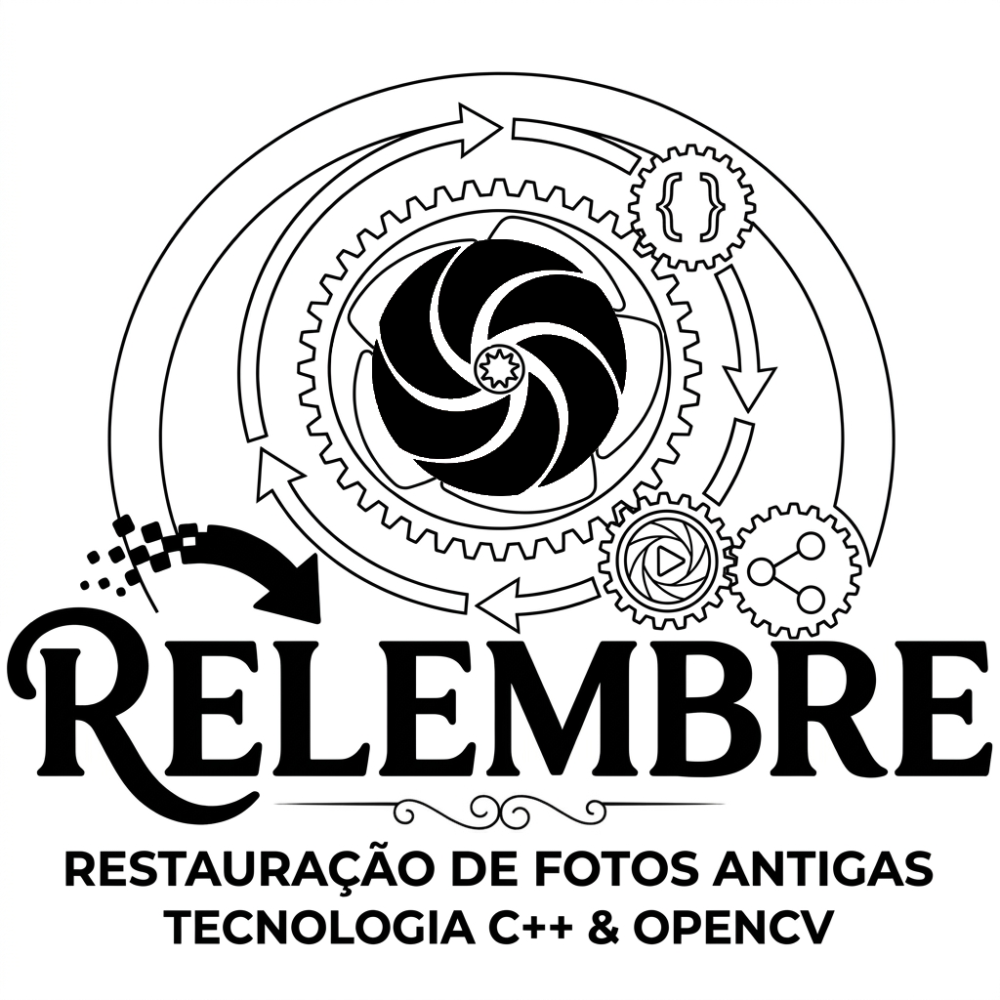

  

 

 
Uma aplicação computacional de restauração de memórias fotográficas de domínio público da cidade de Goianésia, em Goiás, que foi criada visando preservar o patrimônio histórico local e consolidar o aprendizado em C++ e Programação Orientada a Objetos (POO), por meio de processamento digital de imagens com a biblioteca OpenCV.

    
  
A disposição dos arquivos e diretórios que compõem este sistema corresponde à estrutura lógica detalhada a seguir:

  

  
📂 <b>Organização do Repositório</b>

   

  * **assets/**: diretório de recursos estáticos e banner institucional.
  * **include/**: diretório de organização dos cabeçalhos do projeto.
  * **output/**: diretório de saída de dados.
  * **src/**: diretório de código-fonte.

 

